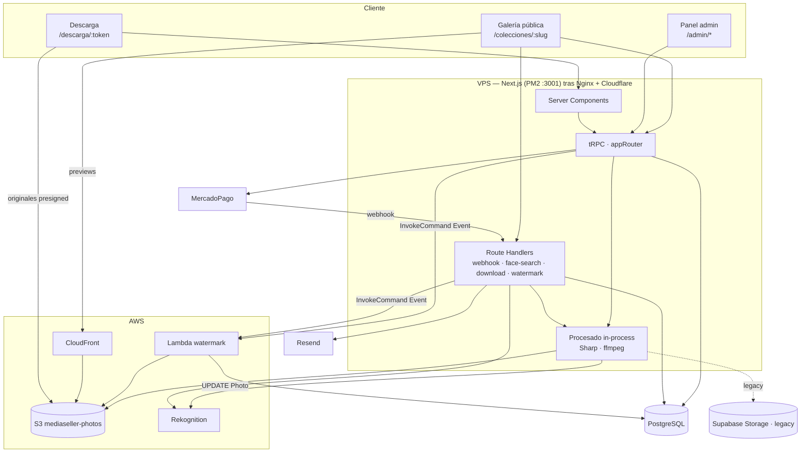
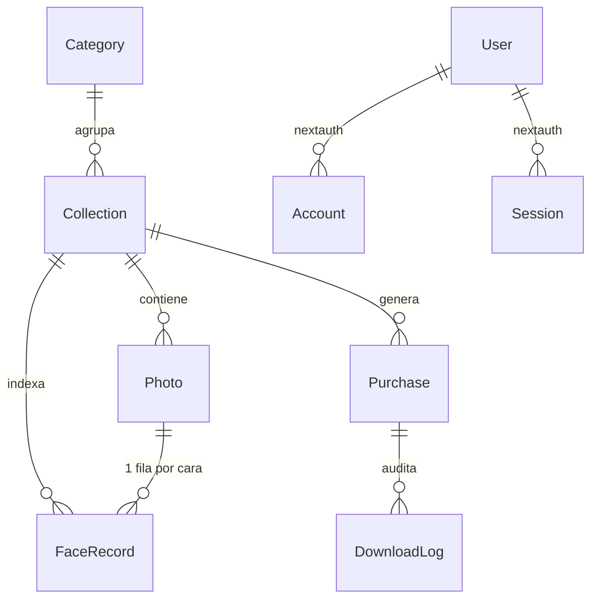
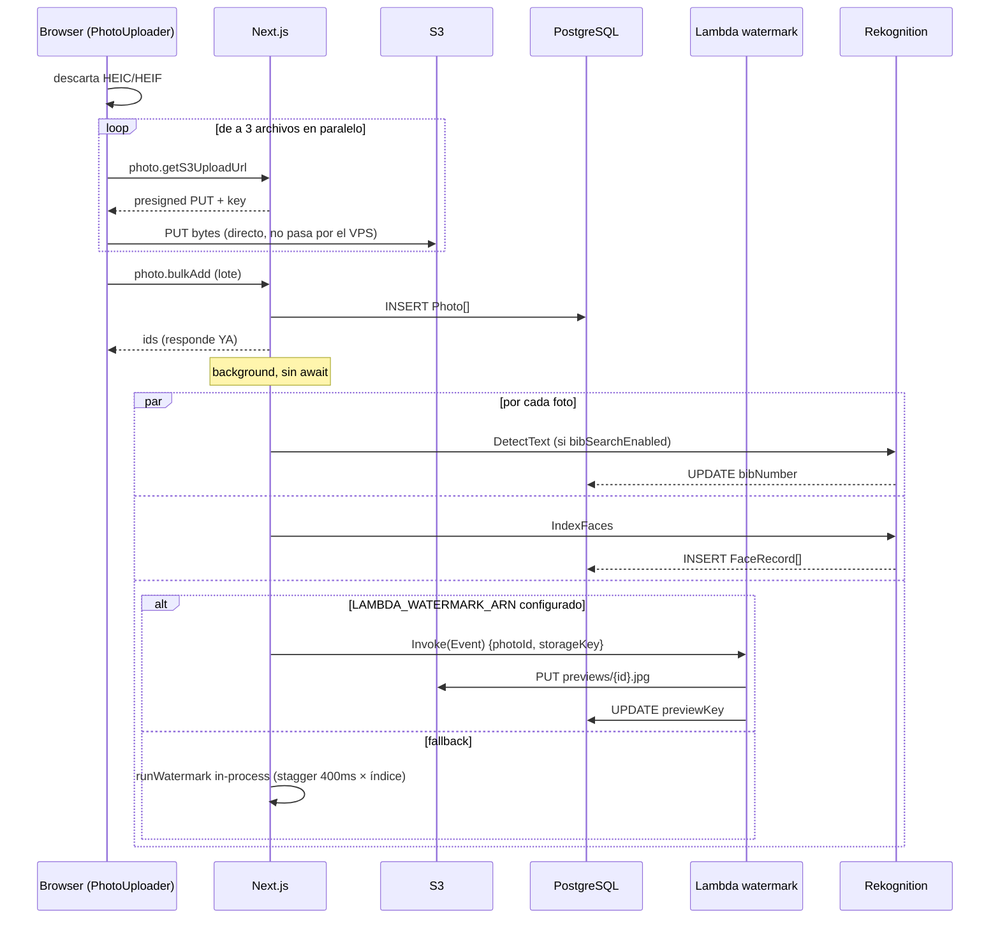
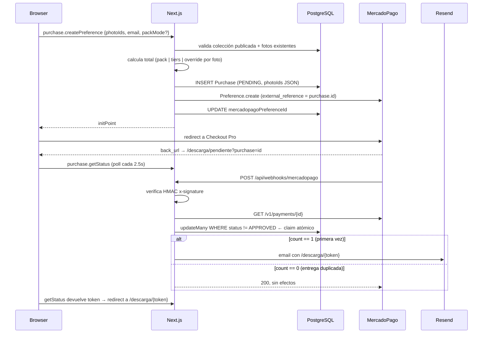

# Arquitectura del sistema — punta a punta

Plataforma de venta de fotos y videos de eventos deportivos (deployment: **Ivana Maritano**).
El fotógrafo sube el material, el corredor busca sus fotos por número de dorsal o por selfie,
compra con MercadoPago y recibe por email un link permanente a los originales en alta resolución
sin marca de agua.

Este documento describe **cómo está construido**: qué piezas hay, cómo se comunican y qué pasa
exactamente en cada flujo, desde el upload hasta la descarga.

---

## 1. Mapa del repositorio

```
ivana-mediaseller/
├── app/                       ← LA aplicación (Next.js 15, App Router). Todo el producto vive acá.
│   ├── prisma/schema.prisma   ← modelo de datos único (PostgreSQL)
│   ├── generated/prisma/      ← cliente Prisma generado (gitignored)
│   ├── scripts/               ← utilidades one-shot en Node (.mjs)
│   └── src/
│       ├── app/               ← rutas (páginas RSC + route handlers)
│       ├── server/            ← tRPC, auth, db
│       ├── lib/               ← S3, CloudFront, Rekognition, Sharp, ffmpeg, Resend, pricing
│       ├── trpc/              ← wiring cliente/servidor de tRPC
│       └── middleware.ts      ← guard de /admin
├── lambda/
│   ├── watermark/index.mjs    ← ★ Lambda EN USO: marca de agua de fotos (Sharp + pg)
│   └── src/handler.ts         ← Lambda alternativa, NO desplegada (ver §11)
├── watermark.zip              ← bundle desplegable de lambda/watermark (Linux x64)
├── aws-iam-*.json             ← políticas IAM de referencia (app y rol de Lambda)
├── fotografo/                 ← app del cliente anterior. Repo propio, gitignored. NO forma parte del sistema.
├── DEPLOY.md                  ← alta de un cliente nuevo (VPS, Nginx, PM2, Cloudflare)
└── CLOUDFRONT-INTEGRATION-GUIDE.md
```

Es un **monolito Next.js** con una única Lambda auxiliar. No hay colas, ni workers, ni
microservicios: el procesamiento pesado corre in-process o se delega a Lambda mediante invocación
directa `Event` (fire-and-forget).

---

## 2. Stack

| Capa | Tecnología | Dónde |
|---|---|---|
| Framework | Next.js 15 App Router + React 19 | `app/` |
| API tipada | tRPC v11 + superjson + Zod | `src/server/api/` |
| Datos | PostgreSQL + Prisma v6 | `prisma/schema.prisma` |
| Auth | NextAuth v5 beta, `CredentialsProvider`, sesión **JWT** | `src/server/auth/` |
| Estado cliente | TanStack Query (vía tRPC) + Context para el carrito | `src/trpc/`, `CartContext` |
| Storage | AWS S3 (originales + previews + watermark) | `src/lib/s3.ts` |
| CDN | CloudFront delante del bucket (solo previews/branding) | `src/lib/media.ts` |
| Storage legacy | Supabase Storage, bucket `photos` | `src/lib/supabase/` |
| Visión | AWS Rekognition (`DetectText`, `IndexFaces`, `SearchFacesByImage`) | `photo-processing.ts`, `face-search` |
| Imágenes | Sharp (in-process **y** en Lambda) | `photo-processing.ts`, `lambda/watermark` |
| Video | fluent-ffmpeg + ffmpeg-static (siempre in-process) | `video-processing.ts` |
| Pagos | MercadoPago (Checkout Pro + OAuth + webhooks) | `purchase.ts`, `api/webhooks/` |
| Email | Resend (HTML inline) | `src/lib/email.ts` |
| Estilos | Tailwind v4 + `motion` | componentes |
| Deploy | VPS · PM2 · Nginx · Cloudflare (Flexible SSL) | `DEPLOY.md` |

---

## 3. Vista de alto nivel



**Regla de oro de la entrega de medios:** el original **nunca** se sirve antes de la compra.
La galería muestra siempre `previewKey` (redimensionado a 1600px, JPEG q72, con marca de agua)
vía CloudFront. El original (`storageKey`) solo sale por URL presignada de S3 o por el proxy
`/api/download/file`, y solo con un `downloadToken` de compra aprobada.

---

## 4. Modelo de datos



### Entidades principales

**`Collection`** — un evento (carrera, maratón). Es la unidad de configuración:
- Identidad pública: `slug`, `title`, `coverUrl` / `bannerUrl` / `logoUrl` (+ `bannerFocalY`), `eventDate`, `location`.
- Comercial: `pricePerBib` (precio base por foto), `packPrice` (precio fijo por todo el resultado de búsqueda), `discountTiers` (JSON de tramos por cantidad), `currency`.
- Comportamiento: `isPublished` (visible), `bibSearchEnabled` (`false` = colección **solo cara**, se oculta el buscador por dorsal y se borran los dorsales existentes).

**`Photo`** — foto **o** video. `storageKey` = original privado; `previewKey` = derivado público
(`.jpg` para fotos, `.mp4` H.264 para videos). `bibNumber` es un **string con dorsales separados
por coma** (`"1234,567"`) porque el OCR puede detectar varios. `price` es override por foto.

**`Purchase`** — una compra. `photoIds` es un **JSON string** con el array de IDs comprados (no
una relación). `downloadToken` (UUID único) es la credencial de descarga. `status` va por el enum
`PENDING → APPROVED | REJECTED | REFUNDED`.

**`FaceRecord`** — una fila por cara indexada en Rekognition. `rekFaceId` es único global; el
puente hacia la foto es `ExternalImageId = photoId` guardado en Rekognition.

**`Setting`** — key/value de plataforma. Hoy guarda los tokens de MercadoPago obtenidos por OAuth
(`mp_access_token`, `mp_refresh_token`, `mp_user_id`).

**`AnalyticsEvent`** — contador crudo de `VISIT | SEARCH_BIB | SEARCH_FACE | CART_ADD`.

---

## 5. Capa de API

Hay **dos** superficies de API, y la elección entre ellas es deliberada:

### tRPC (`/api/trpc/[trpc]`) — todo lo tipado

`appRouter` en [root.ts](app/src/server/api/root.ts) compone 7 routers:

| Router | Público | Admin |
|---|---|---|
| `collection` | `list`, `getBySlug`, `getPrice` | `adminList`, `adminGetById`, `create`, `update`, `delete`, `reorder`, `togglePublish` |
| `photo` | `listAll`, `searchByBib`, `getPreviewUrls` | `getS3UploadUrl`, `bulkAdd`, `delete`, `bulkDelete`, `setBibNumber`, `setPrice`, `reprocessVideo`, `listUnwatermarked`, `listAllIds`, `getStorageUsage` |
| `purchase` | `createPreference`, `getStatus`, `getDownloadInfo`, `accessByEmail`, `makePublic` | `adminStats`, `adminList`, `manualApprove` |
| `category` | `list`, `getBySlug` | CRUD + `reorder` |
| `face` | — | `stats`, `list`, `delete` |
| `settings` | — | `getMpStatus`, `disconnectMp`, `resendPurchaseEmail` |
| `analytics` | — | `adminStats` |

Dos niveles de procedimiento en [trpc.ts](app/src/server/api/trpc.ts):
`publicProcedure` (sin sesión) y `protectedProcedure` (lanza `UNAUTHORIZED` sin `ctx.session.user`).
No hay RBAC: el enum `UserRole` existe en el schema pero **no se chequea en ningún lado** — todo
usuario logueado es admin.

Consumo dual: los Server Components llaman al router directamente vía `createCaller`
([trpc/server.ts](app/src/trpc/server.ts), sin HTTP), los componentes cliente usan
`api.*.useQuery` sobre HTTP.

### Route Handlers — donde tRPC no encaja

| Ruta | Auth | Por qué no es tRPC |
|---|---|---|
| `POST /api/webhooks/mercadopago` | firma HMAC | lo llama MercadoPago |
| `POST /api/face-search` | pública | payload base64 grande + errores de Rekognition mapeados a respuestas; devuelve el `packToken` firmado |
| `GET /api/download/file` | `downloadToken` | streamea bytes con `Content-Disposition` |
| `POST /api/watermark` | sesión | reprocesa una foto/video puntual |
| `POST /api/watermark/batch` | sesión | dispara Lambda masivo con throttle |
| `GET/POST/DELETE /api/watermark-settings` | sesión | `multipart/form-data` |
| `POST /api/uploads/sign` | sesión | firma genérica para branding (portadas, logos, banners) |
| `POST /api/analytics` | pública | fire-and-forget desde el browser |
| `GET /api/mercadopago/connect` + `/callback` | sesión | OAuth redirect flow |
| `/api/auth/[...nextauth]` | — | NextAuth |

### Autenticación

Credenciales email/password contra `User.passwordHash` (bcrypt), sesión **JWT** (sin tabla
`Session` en la práctica). Doble guardia:
- [middleware.ts](app/src/middleware.ts) redirige `/admin/*` sin cookie a `/admin/login`.
  Elige el nombre de cookie (`__Secure-authjs.session-token` vs `authjs.session-token`) según el
  esquema de la request — necesario porque Cloudflare corre en **Flexible SSL** y el origin ve HTTP.
- `protectedProcedure` y `await auth()` en cada route handler admin.

El admin inicial se crea con `scripts/create-admin.mjs`.

---

## 6. Flujo A — Ingesta (el fotógrafo sube material)



Detalles que importan:

- **El VPS nunca ve los bytes del upload.** El browser sube directo a S3 con presigned PUT
  (`expiresIn` 300s). Por eso el bucket necesita CORS con el dominio del cliente (`scripts/setup-s3-cors.mjs`).
- **HEIC/HEIF se rechazan en el cliente**, antes de subir. Sharp no los procesa en este build.
- **`bulkAdd` responde antes de procesar.** El IIFE `void (async () => {...})()` en
  [photo.ts:207](app/src/server/api/routers/photo.ts#L207) no se espera. Si el proceso Node muere
  entre el insert y el procesado, la foto queda registrada **sin preview y sin dorsal** —
  recuperable con "Watermark all" / `regenerate-missing-previews.mjs`.
- **Los videos nunca van a Lambda**: `runVideoWatermark` corre siempre in-process, porque ffmpeg no
  está en el bundle de la Lambda.
- El uploader muestra el dorsal detectado consultando `GET /api/ocr-status`, **una ruta que no
  existe en el repo** (ver §11).

---

## 7. Flujo B — Procesamiento de medios

### Fotos: marca de agua

Misma lógica en dos runtimes ([photo-processing.ts](app/src/lib/photo-processing.ts) y
[lambda/watermark/index.mjs](lambda/watermark/index.mjs)):

1. Descarga el original (S3, o Supabase si la key es legacy).
2. Descarga `watermarks/active.png` — **cacheado 10 minutos en memoria** para no bajarlo por foto.
3. Escala el PNG al 40% del lado menor, lo rota −35° y lo aplica **en mosaico** (`tile: true`).
   Sin PNG configurado, cae a un SVG generado con la palabra `PREVIEW`.
4. Redimensiona a máx. 1600px (`fit: inside`), exporta JPEG q72 mozjpeg.
5. Borra el preview anterior si existía y sube `previews/{photoId}.jpg`.
6. `UPDATE Photo SET previewKey` — Prisma en el path Next, `pg` crudo en la Lambda.

La Lambda es el camino de producción cuando `LAMBDA_WATERMARK_ARN` está seteado; el path
in-process es el fallback de desarrollo y aplica un stagger de `400ms × índice` para no saturar
CPU y RAM del VPS.

El reproceso masivo (`POST /api/watermark/batch`) invoca en **chunks de 50** con 50ms entre chunks
y backoff exponencial (500ms → 4s, 5 intentos) ante `TooManyRequestsException`. Filtra videos.

### Videos

[video-processing.ts](app/src/lib/video-processing.ts) baja a `os.tmpdir()`, corre ffmpeg
(`libx264`, preset fast, CRF 28, AAC 96k, `+faststart`), escala a máx. 1280px de ancho y superpone
el PNG **centrado al 30% de ancho y 45% de opacidad** (no en mosaico, a diferencia de las fotos).
Sube `previews/{photoId}.mp4` y limpia los temporales en `finally`.

`next.config.js` marca `ffmpeg-static` y `fluent-ffmpeg` como externals para que webpack no los
empaquete: son binarios que deben resolverse en runtime desde `node_modules`.

### OCR de dorsales

`DetectText` sobre el original. El scoring en `extractAllBibs` privilegia dorsales de 4 dígitos
(score 5) > 3 dígitos (4) > 2 (3) > 5 (2), suma +3 si el número es la línea completa y
`confianza/50`. Descarta tiempos (`1:23`), porcentajes y distancias (`10 km`). Guarda **todos** los
candidatos ordenados por score, unidos por coma. Es idempotente: si `bibNumber` ya no es `null`, no
vuelve a llamar a Rekognition.

### Índice de caras

`IndexFaces` con `ExternalImageId = photoId`, `MaxFaces: 10`, en una colección de Rekognition por
`Collection` con ID `foto-{collectionId}` (creada on-demand, ignorando
`ResourceAlreadyExistsException`). Cada cara devuelta se upsertea en `FaceRecord`.

---

## 8. Flujo C — Descubrimiento (el corredor busca)

[FolderBrowser.tsx](app/src/app/_components/FolderBrowser.tsx) es el componente central (945
líneas) y concentra tres modos de navegación:

**1. Galería paginada** — `photo.listAll` trae todos los IDs con metadata mínima (sin URLs),
página de 20 en cliente, con filtro `todas | con dorsal | sin dorsal`. Las fotos sin dorsal se
ordenan primero.

**2. Búsqueda por dorsal** — `photo.searchByBib`, debounce de 280ms, dos conjuntos:
- **Exacto**: `bibNumber contains q` (case-insensitive) — el `contains` es lo que hace funcionar
  la búsqueda contra el string multi-dorsal `"1234,567"`.
- **Fuzzy**: solo si `q` es de 3–4 dígitos. Trae candidatos y filtra en memoria por **distancia de
  Hamming = 1** (misma longitud, exactamente un dígito distinto). Se marcan como `SIMILAR` en la UI.

**3. Búsqueda por cara** — el browser redimensiona la selfie a máx. 1200px vía canvas y la manda
como base64 a `POST /api/face-search` (fallback a `FileReader` si el canvas falla).
`SearchFacesByImage` con `FaceMatchThreshold: 80` y `MaxFaces: 50`. Los errores de Rekognition se
mapean a respuestas útiles en vez de 500: `InvalidParameterException` / `ImageTooLargeException` →
`noFaceDetected`, `ResourceNotFoundException` → sin resultados.

**Resolución de URLs — la optimización clave:** ningún tile pide su propia URL. `FolderBrowser`
calcula `visiblePhotos` (memoizado) y hace **una sola** llamada `photo.getPreviewUrls({ ids })`,
con `staleTime` de 50 min (las presigned duran 60). N requests → 1.

`getPreviewUrls` resuelve vía `resolveMediaUrl`: si `CLOUDFRONT_DOMAIN` está configurado devuelve
`https://{dominio}/{key}` (URL estable y cacheable); si no, cae a presigned S3. Este es el ahorro
que documenta [CLOUDFRONT-INTEGRATION-GUIDE.md](CLOUDFRONT-INTEGRATION-GUIDE.md): el egress de S3
era el 97% de la factura.

**Protección del contenido** (`usePhotoProtection`): bloquea click derecho sobre
`[data-photo-protected]` y aplica blur de 3s al detectar `Cmd+Shift+3/4/5`. Es disuasión, no
seguridad — el preview con marca de agua es la protección real.

---

## 9. Flujo D — Compra



### Cálculo de precio

Toda la aritmética vive en [pricing.ts](app/src/lib/pricing.ts) y es **la misma función en cliente y
servidor** (`calcCartTotal`), para que lo que el comprador ve sea exactamente lo que se le cobra. El
cliente nunca manda un monto.

1. **Tramo activo**: `calcEffectivePricePerPhoto(cantidad, pricePerBib, tiers)` busca el tramo de
   mayor `minQty` que califique. Los tramos son `fixed` (precio por foto en ARS) o `percent`
   (descuento). `parseTiers` normaliza también el formato viejo `{minQty, priceEach}`. Lo que
   califica es la **cantidad en el carrito**, no el total de resultados de la búsqueda.
2. **Precio por foto**: `resolvePhotoPrice` aplica el tramo, salvo que la foto tenga un
   `Photo.price` **más barato**. Un override más caro nunca supera al tramo — si no, el cartel
   "Descuento activo · $X c/u" estaría mintiendo.
3. **Redondeo**: los tramos `percent` redondean el precio unitario, y el total se redondea otra vez.
   Sin eso, `3000 × (1 − 0.33)` produce `2009.9999999999998` y esa basura decimal termina en el
   `unit_price` de MercadoPago mientras `amountPaid` (`Decimal(10,2)`) guarda otro número.
4. **Modo pack**: se cobra `min(packPrice, total_individual)` — el pack nunca puede salir más caro
   que comprar esas mismas fotos sueltas.

### El pack es un techo, no un upsell

`packPrice` ("todas las fotos reconocidas por $X") **topea el total**. En cuanto la selección del
comprador cuesta lo mismo que el pack, el checkout lo aplica solo y le entrega el conjunto completo
—cobrarle más que el pack dándole menos fotos no se sostiene—. El comprador puede salirse con
"Volver a selección individual", y esa decisión se respeta (`packOptOut`) para que el efecto no se
la vuelva a imponer.

Ejemplo con base $5.000 y pack $50.000, sobre un corredor con 15 fotos:

| Selecciona | Individual | Pack disponible | Se aplica solo | Entrega | Cobra |
|---:|---:|:---:|:---:|---:|---:|
| 3 | $15.000 | sí (upsell) | no | 3 | $15.000 |
| 12 | $60.000 | sí | **sí** | **15** | **$50.000** |
| 15 | $75.000 | sí | **sí** | 15 | **$50.000** |

El pack no se ofrece cuando no le gana al total individual (con 5 fotos, $25.000 < $50.000).

`applyPackCeiling` en [pricing.ts](app/src/lib/pricing.ts) es el **único** lugar que decide esto, y
lo llaman las tres superficies que muestran un total: la barra flotante, el cajón de la nav y el
checkout. Si no, agregar las 15 fotos a mano mostraba $75.000 mientras el botón "Comprar todas"
decía $50.000. Por eso `PackOffer` vive en [CartContext](app/src/app/_components/CartContext.tsx):
el carrito de la nav se renderiza fuera de la vista de resultados y necesita el mismo dato.

La función exige que el carrito sea **subconjunto del set del pack**, para que un carrito que quedó
de otra búsqueda no se lleve prestado este precio.

### Botón "llevar todas"

Sobre cada grilla de resultados —dorsal y cara— hay una `ResultsActions` con el conteo, "Agregar
las N al carrito" y, si el pack conviene, "Comprar todas · $X" con el ahorro. Es el atajo para lo
que el corredor realmente quiere después de encontrarse. Solo aparece en resultados de búsqueda: la
galería sin buscar no es un conjunto "reconocido".

### Validación del pack

El pack es un precio plano por "todas las fotos de tu búsqueda", así que el servidor tiene que saber
que el conjunto pedido **es realmente un resultado de búsqueda**. Si no, cualquiera podría mandar
todos los IDs de la colección (son públicos vía `photo.listAll`) y comprar el evento entero por un
precio de pack. `isLegitimatePackSet` exige una de dos pruebas:

| Contexto | Prueba | Cómo se valida |
|---|---|---|
| Búsqueda por dorsal | `packBib` | el servidor **re-ejecuta** la query de dorsal y exige que lo pedido sea un subconjunto |
| Búsqueda por cara | `packToken` | HMAC-SHA256 sobre `collectionId + ids ordenados + expiración`, firmado por `/api/face-search` ([pack-token.ts](app/src/lib/pack-token.ts)), TTL 1h |

Sin ninguna de las dos, el pack se rechaza. Navegar la galería sin buscar **no** es un contexto de
pack, y la UI no lo ofrece ahí.

En el cliente, el conjunto del pack (`PackOffer` en [FolderModal.tsx](app/src/app/_components/FolderModal.tsx))
es siempre el **resultado completo**, nunca una página de él, y excluye las coincidencias `fuzzy`
—que son dorsales de otros corredores—. El pack solo se muestra si `packPrice < total_individual`,
y solo se rotula "Mejor oferta" si además le gana a la selección actual.

### Webhook — idempotencia

MercadoPago entrega *at-least-once*. La defensa está en
[route.ts:85-99](app/src/app/api/webhooks/mercadopago/route.ts#L85-L99): un `updateMany` con
`WHERE id = ? AND status != APPROVED` que actúa como claim atómico. Solo la entrega cuyo
`count === 1` rota el `downloadToken` y manda el email; las demás hacen ACK y salen. Sin esto, una
entrega duplicada **invalidaba el link ya enviado** y mandaba un segundo email — el bug documentado
en `BUG-DUPLICATE-DELIVERY-EMAILS.md`, corregido en `eef8c6f`.

La firma se valida con HMAC-SHA256 sobre `id:{requestId};request-id:{requestId};ts:{ts};{body}`.
Si `MERCADOPAGO_WEBHOOK_SECRET` no está seteado, **la verificación se saltea** (`return true`) —
aceptable en dev, obligatorio configurarlo en producción.

El handler devuelve `200 {received:true}` ante cualquier error, incluido el `catch` general, para
que MercadoPago no reintente indefinidamente.

### Credenciales de MercadoPago

`getMp()` prioriza `Setting["mp_access_token"]` (obtenido por OAuth desde
`/admin/configuracion`) y cae a `MERCADOPAGO_ACCESS_TOKEN` del entorno. El flujo OAuth usa una
cookie `mp_oauth_state` para protección CSRF.

> Inconsistencia: `createPreference` usa el token de `Setting`, pero el webhook consulta el pago
> siempre con `env.MERCADOPAGO_ACCESS_TOKEN`. Si solo se conectó por OAuth, el `fetch` a
> `/v1/payments/{id}` falla y la compra queda en `PENDING`.

---

## 10. Flujo E — Entrega

`/descarga/[token]` es un Server Component que llama `purchase.getDownloadInfo`. Ese procedimiento
valida el token, exige `status === APPROVED` y devuelve **presigned S3 de 24h de los originales**
(`storageKey`, no `previewKey`) — este es el único punto del sistema donde salen los archivos sin
marca de agua.

También sugiere otras colecciones publicadas donde exista el mismo dorsal y que el comprador aún no
haya comprado (upsell).

La descarga real va por `GET /api/download/file?token&photoId`, que:
1. valida el token y que el `photoId` esté en `Purchase.photoIds`,
2. genera una presigned de 300s,
3. hace `fetch` desde el servidor y **streamea** la respuesta con
   `Content-Disposition: attachment` y `Cache-Control: private, no-store`.

El proxy existe para forzar la descarga con el nombre original (incluye variante ASCII y
`filename*=UTF-8''` para tildes) en vez de abrir la imagen en una pestaña.

**El token no expira.** El schema documenta 72h y existe `downloadTokenExpires`, pero tanto el
webhook como `manualApprove` lo setean explícitamente en `null`, y el email dice "El link no
expira". Cualquiera con el link accede a los originales — es una decisión de producto, no un
descuido, pero conviene tenerla presente.

---

## 11. Storage

### Layout en S3 (bucket `mediaseller-photos`)

```
{PREFIX}/uploads/{collectionId}/{timestamp}-{random}.{ext}   ← originales (privados)
{PREFIX}/previews/{photoId}.jpg                              ← fotos con marca de agua
{PREFIX}/previews/{photoId}.mp4                              ← videos transcodificados
{PREFIX}/watermarks/active.png                               ← PNG de marca de agua activo
{PREFIX}/...                                                 ← portadas, logos, banners (vía /api/uploads/sign)
```

`AWS_S3_PREFIX` (ej. `ivana`) aísla deployments dentro de un bucket compartido. `s3Key()` lo aplica
a toda key nueva; `isS3Key()` decide el backend de una key existente: `true` si empieza con el
prefijo, o con `uploads/` / `previews/` (retrocompatibilidad con keys anteriores al prefijo). Todo
lo demás se asume Supabase.

### CloudFront

Distribución sobre el bucket completo. `getCFUrl()` devuelve `https://{CLOUDFRONT_DOMAIN}/{key}`
y `resolveMediaUrl()` la usa para **previews, portadas, logos, banners y el watermark**. Los
originales post-compra **nunca** pasan por CloudFront: siempre presigned S3 directo.

Al reemplazar el PNG de marca de agua se dispara `createCFInvalidation` (fire-and-forget, errores
solo logueados).

### Supabase Storage

Legacy. El código mantiene el camino de lectura (`createSignedUrl`, `download`, `remove`) para
fotos migradas de un deployment anterior, pero **nada nuevo se escribe ahí**: el watermark ya vive
en S3 (`WATERMARK_KEY = s3Key("watermarks/active.png")`). `scripts/migrate-supabase-to-s3.mjs`
existe para completar la migración.

### Cuota

`STORAGE_LIMIT_BYTES = 100 GB`, calculado como `SUM(Photo.fileSize)` **global**, no por colección.
Se muestra en el panel (`StorageBar`) pero **no se aplica**: nada bloquea un upload que la exceda.
El límite de 10k fotos se removió en `f46fae4`.

---

## 12. Configuración

Validada con `@t3-oss/env-nextjs` + Zod en [env.js](app/src/env.js). Solo `DATABASE_URL` y
`AUTH_SECRET` (en producción) son obligatorias; **todo lo demás es opcional**, y ese es el
mecanismo de degradación del sistema:

| Sin la variable | Qué pasa |
|---|---|
| `LAMBDA_WATERMARK_ARN` | marca de agua in-process con stagger |
| `CLOUDFRONT_DOMAIN` | previews por presigned S3 (funciona, cuesta más) |
| `RESEND_API_KEY` | `sendPurchaseApprovedEmail` retorna sin hacer nada — **compra aprobada sin email** |
| `MERCADOPAGO_ACCESS_TOKEN` + sin OAuth | `createPreference` lanza error explicando ir a `/admin/configuracion` |
| `MERCADOPAGO_WEBHOOK_SECRET` | **se acepta cualquier webhook sin verificar firma** |
| `SUPABASE_SERVICE_ROLE_KEY` | las keys legacy de Supabase dejan de resolver |
| `NEXT_PUBLIC_BASE_URL` (o localhost) | la preference se crea sin `back_urls` ni `notification_url` |

Lista completa de variables en [README.md](README.md#variables-de-entorno) y [DEPLOY.md](DEPLOY.md).

---

## 13. Deploy y operación

**Topología:** Cloudflare (DNS proxy, **Flexible SSL**) → Nginx (`proxy_pass` a `localhost:300X`,
`client_max_body_size 500M`) → PM2 → `next start`. Un proceso Node por cliente, todos compartiendo
el mismo bucket S3 (separados por `AWS_S3_PREFIX`) y las mismas credenciales AWS. Base de datos
separada por cliente.

El paso a paso completo para un alta está en [DEPLOY.md](DEPLOY.md).

**Consecuencia arquitectónica del VPS:** que el procesamiento corra in-process (Sharp, ffmpeg,
promesas sin await que sobreviven a la respuesta) solo funciona porque hay un proceso Node de larga
vida. Este código **no es portable a serverless** tal cual está: en Vercel/Lambda, el trabajo
lanzado con `void` se cortaría al terminar la request.

**Lambda de marca de agua:** se construye con `lambda/build.sh` (`npm install --platform=linux
--arch=x64` para el binario nativo de Sharp) y se sube `watermark.zip` a mano. Necesita
`BUCKET_NAME`, `BUCKET_REGION`, `BUCKET_PREFIX` y `DATABASE_URL`, y acceso de red a Postgres.
Mantiene un pool `pg` de `max: 1` a nivel de módulo para reusarlo entre invocaciones warm.

**Scripts de mantenimiento** (`app/scripts/`, se corren con `node`):

| Script | Para qué |
|---|---|
| `create-admin.mjs` | crea el usuario admin inicial (credenciales hardcodeadas — cambiar antes de usar) |
| `setup-s3-cors.mjs` | configura CORS del bucket para el dominio del cliente |
| `regenerate-missing-previews.mjs` | recupera fotos que quedaron sin `previewKey` |
| `migrate-supabase-to-s3.mjs` | migra storage legacy |
| `clear-bibs-face-only-collections.mjs` | limpia dorsales al pasar una colección a modo solo-cara |

---

## 14. Estado conocido: deuda y trampas

Cosas reales del código que conviene saber antes de tocarlo.

**Roto / faltante**
- **`GET /api/ocr-status` no existe.** `PhotoUploader` lo hace polling
  ([PhotoUploader.tsx:165](app/src/app/_components/admin/PhotoUploader.tsx#L165)) y recibe 404, así
  que el badge de dorsal detectado nunca se completa durante el upload (el dorsal sí se guarda en DB).
- **Token de MP inconsistente**: OAuth para crear preferences, env var para el webhook (§9).

**Sin usar**
- `DownloadLog` — modelo completo con índices, cero escrituras. La auditoría de descargas está
  diseñada pero no implementada.
- `Purchase.downloadCount`, `firstDownloadAt`, `downloadTokenExpires` — nunca se escriben.
- `Collection.watermarkStorageKey` (watermark por colección — el sistema usa uno global),
  `Collection.isFree`, `Photo.previewGeneratedAt`, `Photo.isPublic`.
- `UserRole` / `PHOTOGRAPHER` — no hay chequeo de rol en ningún lado.
- `jszip` en `package.json` — sin imports. La descarga es archivo por archivo.
- `lambda/src/handler.ts` — Lambda basada en triggers `s3:ObjectCreated` que **crearía** los
  registros `Photo`. Es una arquitectura alternativa a la actual (donde `bulkAdd` los crea y
  la Lambda solo marca agua). No está desplegada; si se activara, duplicaría filas.

**Fragilidades**
- El procesamiento en background no tiene reintentos ni cola: un restart de PM2 durante un upload
  masivo deja fotos sin preview.
- `photo.listAll` trae **todas** las fotos de la colección en cada carga de página. Con miles de
  fotos, el payload crece linealmente aunque solo se muestren 20.
- El fuzzy match trae todos los candidatos con dorsal de la colección a memoria para filtrar en JS.
- `collection.delete` borra `Purchase` y `Photo` de la DB, pero **no borra los objetos de S3** ni
  las colecciones de Rekognition.
- Las URLs de CloudFront no están firmadas: cualquiera con la URL de un preview la puede compartir.
  Aceptable porque los previews llevan marca de agua.
- La marca de agua se aplica **en mosaico** en fotos pero **centrada** en videos: distinto nivel de
  protección según el medio.

---

## 15. Cómo agregar cosas

- **Nueva query/mutation** → router en `src/server/api/routers/`, registrar en `root.ts`.
  `publicProcedure` o `protectedProcedure` según corresponda; nunca aceptar montos del cliente.
- **Nuevo tipo de medio** → tocar `video-utils.ts` (detección), `photo.bulkAdd` (ruteo) y agregar
  su `run*Watermark`.
- **Nueva URL de medio** → `resolveMediaUrl()` si es display; `createS3DownloadUrl()` **solo** si es
  un original post-compra.
- **Cambio de schema** → editar `prisma/schema.prisma`, `npx prisma db push` (el proyecto usa
  `db push`, no migraciones versionadas), `npx prisma generate`.
- **Nuevo cliente/deployment** → seguir [DEPLOY.md](DEPLOY.md); lo crítico es un `AWS_S3_PREFIX`
  único y un puerto PM2 libre.
